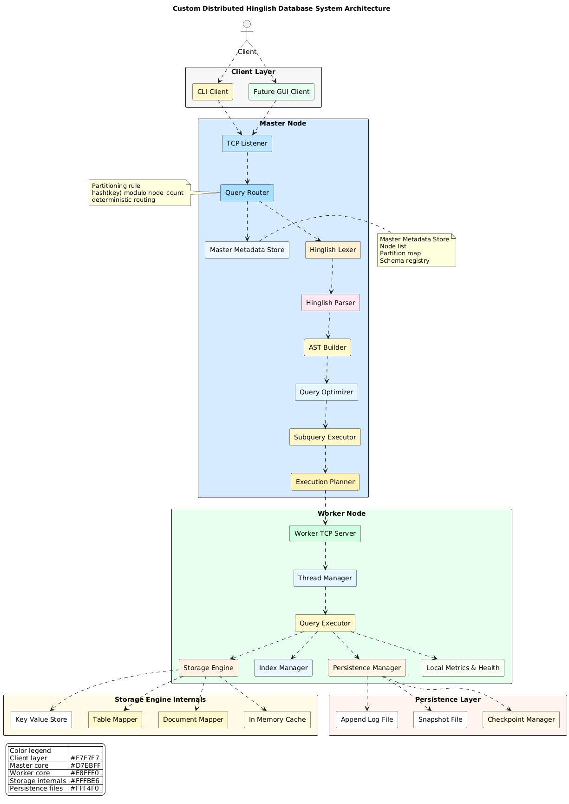

# InventixDB (WIP)

> **Status**: Prototype Phase 2 (Storage Engine Overhaul)
> **Codebase**: ~4,100 Lines of C
> **University Project**: Semester 5
>
> **Note**: This project is currently in the **Integration Phase**. The core has been upgraded from a pure in-memory Key-Value store to a **Hybrid Engine** featuring a disk-based B+ Tree with a custom Buffer Pool.

InventixDB is a custom, mini distributed database system implemented in C. It features a unique **Roman-Urdu (Hinglish)** query syntax and a **Hybrid Architecture** supporting both structured (SQL-like) and semi-structured (JSON) data.

## System Architecture



The system follows a layered architecture designed for modularity and distributed data handling.

### Architecture Overview
1.  **Client Layer**: 
    -   CLI (`inventixdb`) for interacting with the database.
    -   Supports REPL with detailed help and auto-completion hints.
2.  **frontend (Lexer/Parser)**:
    -   **Hinglish Lexer**: Tokenizes distinct keywords like `BANAO` (Create), `JAHAN` (Where), `NIKALO` (Delete).
    -   **Recursive Descent Parser**: Builds an AST to represent queries.
3.  **Storage Engine (New)**:
    -   **Legacy**: In-Memory Hash Map with Append-Only Log (AOF) for crash recovery.
    -   **Modern**: **B+ Tree** implementation with **Page-Based Storage** (4KB pages).
    -   **Buffer Pool**: Standard LRU-Replacer buffer pool to manage memory for disk pages.
    -   **Dual-Write**: Currently writes to both engines to ensure stability during migration.
4.  **Backend**: 
    -   **TCP Listener**: Accepts client connections.
    -   **Distributed Mode**: Experimental master-worker sharding.

---

## Features

- [x] **Custom Syntax**: Write queries in Hinglish (e.g., `JAHAN` instead of `WHERE`).
- [x] **Storage Engine**: Valid B+ Tree with paging, splitting/merging nodes, and binary row serialization.
- [x] **DataType Support**: `INT`, `FLOAT`, `STRING`/`TEXT`, `BOOL`.
- [x] **Primary Keys**: Validates unique constraints on IDs.
- [x] **Auto Increment**: Support for `AUTO` keyword in `INSERT` statements.
- [x] **Persistence**: Data survives restarts (Log-Structured storage + B+ Tree File).
- [x] **Hybrid Model**: Supports both Relational Tables and basic JSON Document storage.
- [ ] **Transaction Support**: Basic locking exists, but ACID transactions are WIP.

---

## Hinglish Query Language (HQL) Reference

### 1. Data Definition (DDL)

**Create Table**
```sql
TABLE BANAO users (
    id INT PRIMARY KEY,
    name TEXT,
    is_active BOOL
);
```

**Index Creation**
```sql
CREATE INDEX ON users (name);
```

### 2. Data Manipulation (DML)
**Insert Data**
```sql
INSERT KARO users VALUES (1, "Ali", 1);
INSERT KARO users VALUES (AUTO, "Sara", 1);
```

**Select Data**
```sql
SELECT name FROM users JAHAN id = 1;
```

**Delete Data**
```sql
NIKALO FROM users JAHAN id = 1;
```

### 3. NoSQL / Document Operations
**Store Document**
```sql
RAKHO logs "{\"event\": \"login\", \"time\": 1234}";
```

---

## Build & Run

### Prerequisites
*   GCC (MinGW on Windows or standard GCC on Linux)
*   Make

### Compilation
The project supports modular compilation.

```bash
make
```

### Running the CLI
```bash
./inventixdb
```

### Development Testing
To test the B+ Tree engine in isolation:
```bash
./test_btree
```
