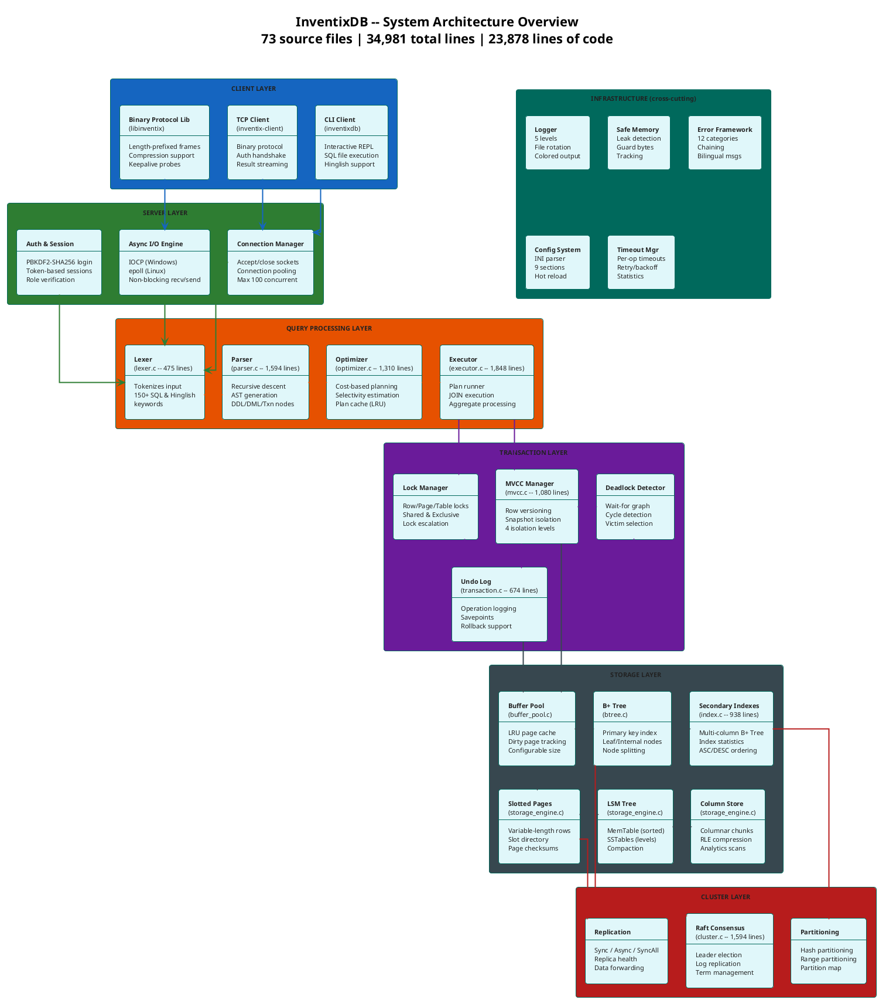
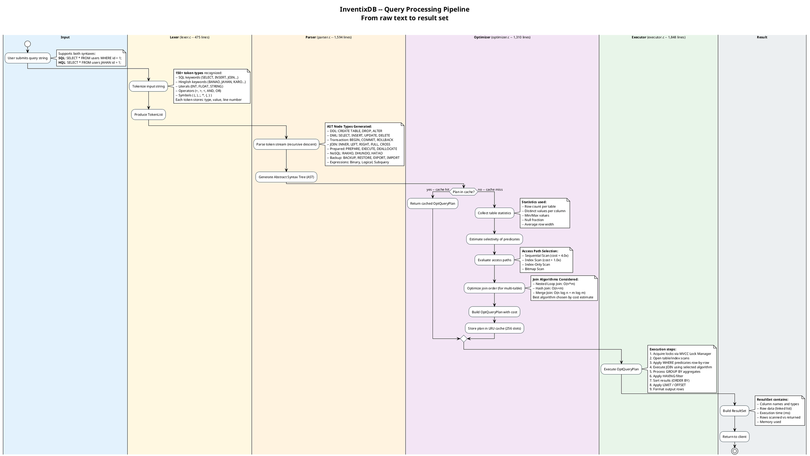
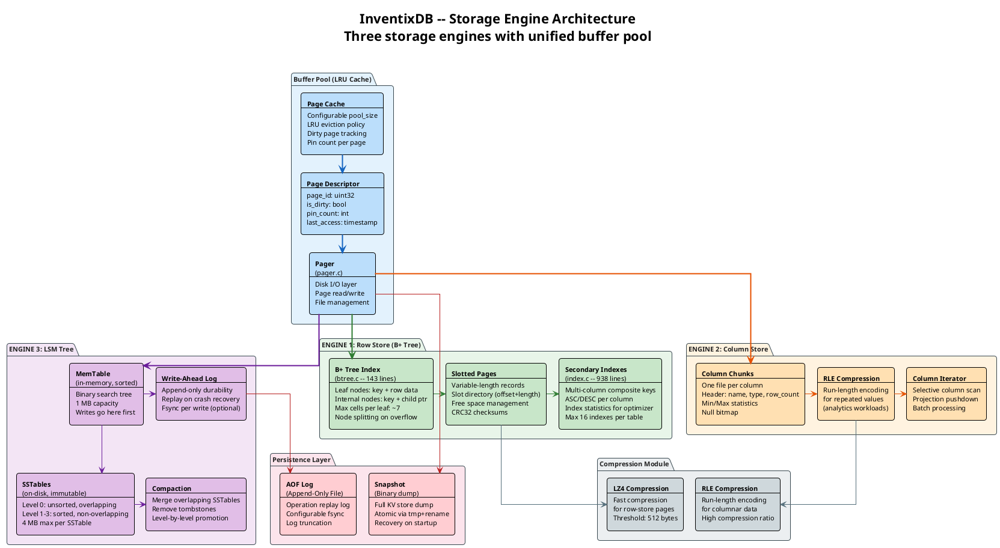
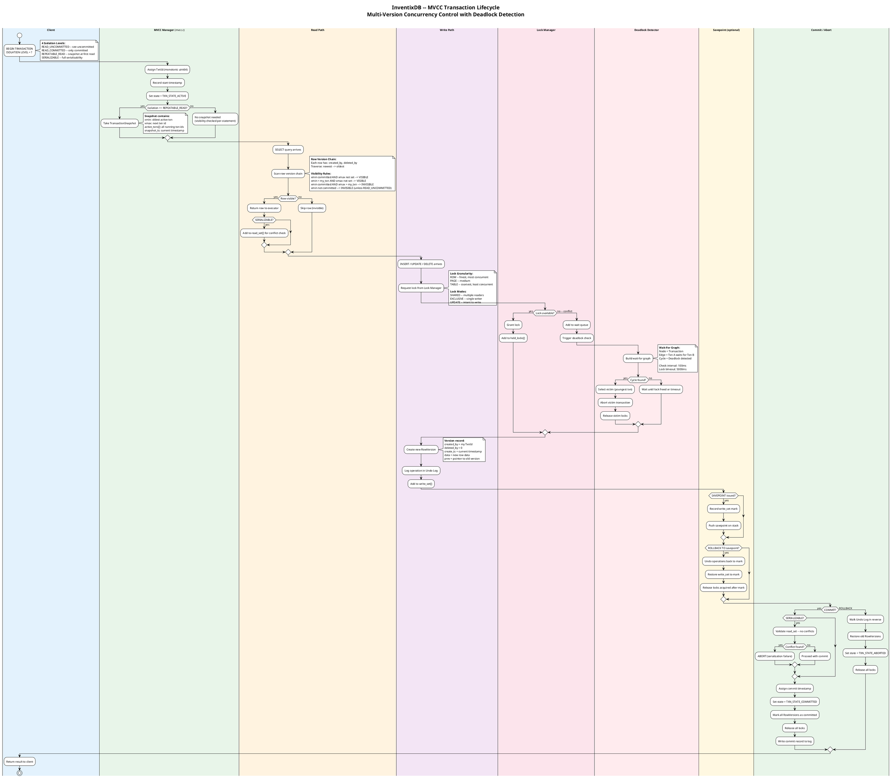
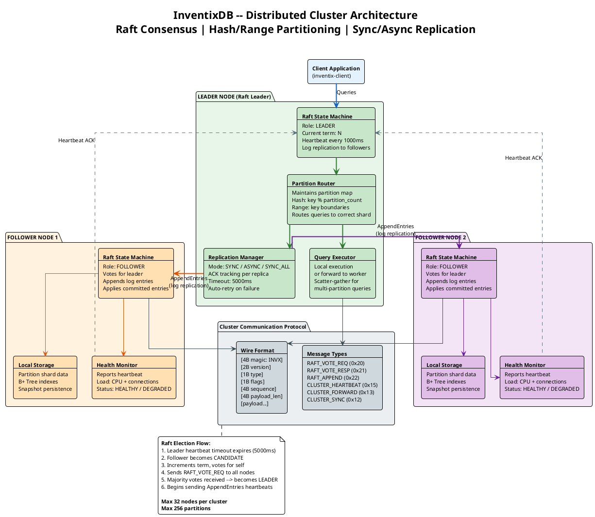
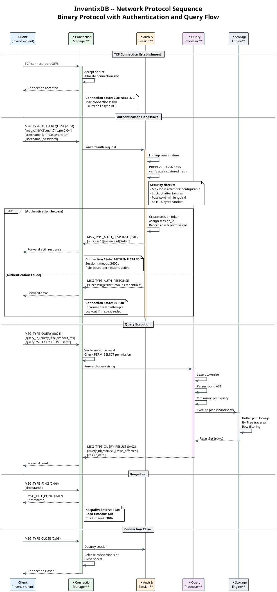
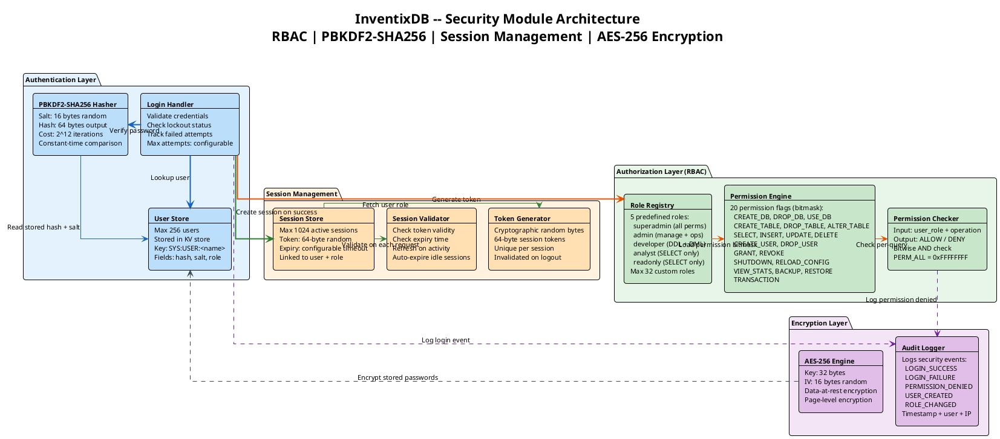
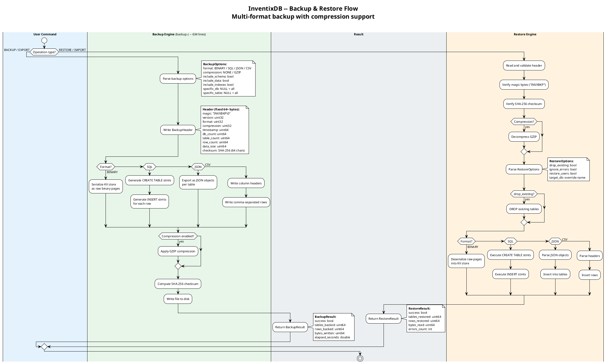
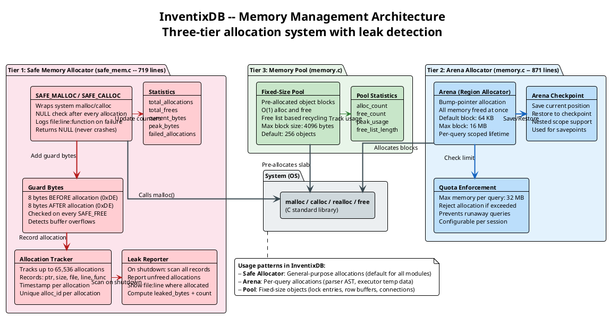

# InventixDB System Architecture Diagrams

> PlantUML source code for generating all architecture and flow diagrams.
> Render these using [plantuml.com](https://www.plantuml.com/plantuml/uml/) or any PlantUML-compatible tool.

---

## Table of Contents

1. [High-Level System Architecture](#1-high-level-system-architecture)
2. [Query Processing Pipeline](#2-query-processing-pipeline)
3. [Storage Engine Architecture](#3-storage-engine-architecture)
4. [MVCC Transaction Flow](#4-mvcc-transaction-flow)
5. [Distributed Cluster Architecture](#5-distributed-cluster-architecture)
6. [Network Protocol Flow](#6-network-protocol-flow)
7. [Security Module Architecture](#7-security-module-architecture)
8. [Backup and Restore Flow](#8-backup-and-restore-flow)
9. [Memory Management Architecture](#9-memory-management-architecture)
10. [Component Dependency Map](#10-component-dependency-map)

---

## 1. High-Level System Architecture

Complete layered view of InventixDB showing all six architectural layers and their internal components.



---

## 2. Query Processing Pipeline

Detailed flow from raw SQL/Hinglish text through tokenization, parsing, optimization, and execution.



---

## 3. Storage Engine Architecture

Three storage engines (Row Store, Column Store, LSM Tree) with buffer pool and page management.



---

## 4. MVCC Transaction Flow

Detailed transaction lifecycle showing isolation levels, locking, versioning, and deadlock detection.



---

## 5. Distributed Cluster Architecture

Raft consensus, partitioning, replication, and cluster communication.



---

## 6. Network Protocol Flow

Client-server communication sequence showing the binary protocol handshake, authentication, and query execution.



---

## 7. Security Module Architecture

RBAC, password hashing, session management, and permission checking.



---

## 8. Backup and Restore Flow

Complete backup/restore lifecycle with format options and compression.



---

## 9. Memory Management Architecture

Three-tier memory system: Safe Allocator, Arena Allocator, and Memory Pool.



---

## 10. Component Dependency Map

Shows which source modules depend on which others (compile-time dependencies).

```plantuml
@startuml InventixDB_Dependency_Map
!theme plain
skinparam linetype ortho
skinparam ranksep 25
skinparam nodesep 15
skinparam defaultFontName "Segoe UI"
skinparam defaultFontSize 10
skinparam shadowing false
skinparam roundCorner 6

skinparam component {
    BackgroundColor #FFFFFF
    BorderColor #37474F
    FontColor #212121
}

title **InventixDB -- Module Dependency Map**\nCompile-time dependencies between source modules\n

' ============================================================
' ENTRY POINTS (top)
' ============================================================
component "**main.c**\nCLI Entry" as MAIN #E3F2FD
component "**server.c**\nServer Entry" as SERVER #E3F2FD
component "**client.c**\nClient Entry" as CLIENT #E3F2FD

' ============================================================
' QUERY LAYER
' ============================================================
component "**lexer.c**\nTokenizer" as LEXER #FFF3E0
component "**parser.c**\nAST Builder" as PARSER #FFF3E0
component "**optimizer.c**\nQuery Planner" as OPTIMIZER #FFF3E0
component "**executor.c**\nPlan Runner" as EXECUTOR #FFF3E0
component "**prepared.c**\nStmt Cache" as PREPARED #FFF3E0
component "**join.c**\nJOIN Algos" as JOIN #FFF3E0
component "**query_result.c**\nSort/Limit" as QR #FFF3E0
component "**nosql.c**\nDocument Store" as NOSQL #FFF3E0

' ============================================================
' TRANSACTION LAYER
' ============================================================
component "**mvcc.c**\nVersioning" as MVCC #F3E5F5
component "**transaction.c**\nUndo Log" as TXN #F3E5F5

' ============================================================
' STORAGE LAYER
' ============================================================
component "**storage.c**\nKV Store" as STORAGE #ECEFF1
component "**btree.c**\nB+ Tree" as BTREE #ECEFF1
component "**buffer_pool.c**\nPage Cache" as BUFPOOL #ECEFF1
component "**pager.c**\nDisk I/O" as PAGER #ECEFF1
component "**storage_engine.c**\nMulti-Engine" as SENGINE #ECEFF1
component "**index.c**\nSecondary Idx" as INDEX #ECEFF1
component "**backup.c**\nBackup/Restore" as BACKUP #ECEFF1

' ============================================================
' NETWORK & CLUSTER
' ============================================================
component "**network.c**\nBinary Protocol" as NETWORK #FCE4EC
component "**distributed.c**\nMaster-Worker" as DIST #FCE4EC
component "**cluster.c**\nRaft Consensus" as CLUSTER #FCE4EC

' ============================================================
' SECURITY
' ============================================================
component "**security.c**\nRBAC/Crypto" as SECURITY #E8F5E9
component "**auth.c**\nLogin Handler" as AUTH #E8F5E9

' ============================================================
' INFRASTRUCTURE
' ============================================================
component "**config.c**\nINI Parser" as CONFIG #E0F7FA
component "**logger.c**\nLogging" as LOGGER #E0F7FA
component "**safe_mem.c**\nLeak Detection" as SAFEMEM #E0F7FA
component "**error.c**\nError Framework" as ERROR #E0F7FA
component "**memory.c**\nArena/Pool" as MEMORY #E0F7FA
component "**timeout_config.c**\nTimeouts" as TIMEOUT #E0F7FA

' ============================================================
' DEPENDENCIES
' ============================================================
' Entry points
MAIN    -[#1565C0]down-> LEXER
MAIN    -[#1565C0]down-> EXECUTOR
MAIN    -[#1565C0]down-> STORAGE
SERVER  -[#1565C0]down-> NETWORK
SERVER  -[#1565C0]down-> SECURITY
SERVER  -[#1565C0]down-> CLUSTER
CLIENT  -[#1565C0]down-> NETWORK

' Query pipeline
LEXER     -[#E65100]right-> PARSER
PARSER    -[#E65100]right-> OPTIMIZER
OPTIMIZER -[#E65100]right-> EXECUTOR
EXECUTOR  -[#E65100]down-> JOIN
EXECUTOR  -[#E65100]down-> QR
EXECUTOR  -[#E65100]down-> PREPARED
EXECUTOR  -[#E65100]down-> NOSQL
EXECUTOR  -[#E65100]down-> BACKUP

' Transaction
EXECUTOR -[#6A1B9A]down-> MVCC
EXECUTOR -[#6A1B9A]down-> TXN
MVCC     -[#6A1B9A]down-> STORAGE

' Storage
STORAGE  -[#37474F]down-> BTREE
BTREE    -[#37474F]down-> BUFPOOL
BUFPOOL  -[#37474F]down-> PAGER
STORAGE  -[#37474F]right-> INDEX
STORAGE  -[#37474F]right-> SENGINE

' Network/Cluster
NETWORK  -[#B71C1C]down-> TIMEOUT
DIST     -[#B71C1C]down-> NETWORK
CLUSTER  -[#B71C1C]down-> NETWORK

' Security
AUTH     -[#2E7D32]down-> STORAGE
SECURITY -[#2E7D32]down-> AUTH

' Infrastructure (everything depends on these)
SAFEMEM ..[#00695C]down.> ERROR : uses
LOGGER  ..[#00695C]down.> CONFIG : reads config
MEMORY  ..[#00695C]down.> SAFEMEM : wraps

@enduml
```



---

## Rendering Instructions

### Online (Quickest)

1. Go to [plantuml.com/plantuml/uml](https://www.plantuml.com/plantuml/uml/)
2. Copy any diagram block above (between the triple-backtick fences, starting from `@startuml` to `@enduml`)
3. Paste and click **Submit**

### VS Code

1. Install the **PlantUML** extension (`jebbs.plantuml`)
2. Open this file
3. Place cursor inside any `plantuml` code block
4. Press `Alt+D` to preview

### Command Line

```bash
# Install PlantUML
# (requires Java runtime)
java -jar plantuml.jar diagrams.md -o output/

# Or with Docker
docker run -v $(pwd):/data plantuml/plantuml diagrams.md
```

### Export Formats

PlantUML supports PNG, SVG, PDF, and EPS output. For high-resolution documentation, use SVG:

```bash
java -jar plantuml.jar -tsvg diagrams.md -o output/
```
